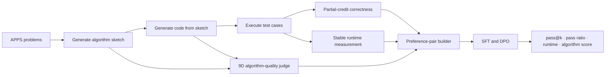

<div align="center">

# Sketch-Guided Multi-Objective Alignment

### Aligning code language models for correctness, efficiency, and algorithmic reasoning

[](https://www.python.org/)
[](https://pytorch.org/)
[](https://arxiv.org/abs/2305.18290)
[](https://github.com/hendrycks/apps)
[](https://huggingface.co/bigcode/starcoder2-3b)

</div>

## Overview

This repository explores a simple question: **can code language models be aligned not only to produce correct and fast programs, but also to prefer sound algorithmic reasoning?**

The framework extends the correctness-and-efficiency preference signals introduced by [Code-Optimise](https://arxiv.org/abs/2406.12502) with an explicit algorithm-quality objective. It first asks a model to generate a high-level solution sketch, then generates code conditioned on that sketch. Candidate solutions are evaluated along three complementary axes:

1. **functional correctness** through partial-credit execution;
2. **runtime efficiency** among fully correct solutions;
3. **algorithmic quality** through a structured nine-dimension LLM-as-a-judge rubric.

The resulting signals are converted into supervised fine-tuning examples and several families of Direct Preference Optimization (DPO) pairs.

## Research contributions

- **Sketch-first generation.** Reasoning and implementation are sampled in two stages, making the intermediate algorithmic plan observable and independently assessable.
- **Partial-credit correctness.** `pass_ratio ∈ [0, 1]` preserves information that binary pass/fail labels discard.
- **Structured algorithm assessment.** Four sketch dimensions and five code dimensions measure correctness, specificity, complexity awareness, faithfulness, readability, and edge-case handling.
- **Signal-specific preference pairs.** The framework constructs correctness, efficiency, and algorithm-quality pairs under explicit eligibility constraints.
- **End-to-end experimental pipeline.** Numbered entry points cover data preparation, pilot sampling, annotation, dataset construction, SFT, DPO, and evaluation.

## Method



### Preference objectives

| Objective | Chosen candidate | Rejected candidate | Purpose |
| --- | --- | --- | --- |
| **HvL** | High partial-credit solution | Low partial-credit solution | Learn graded functional correctness |
| **PvF** | Fully passing solution | Fully failing solution | Binary ablation of HvL |
| **QvS** | Faster fully correct solution | Slower fully correct solution | Improve execution efficiency |
| **GvB** | Higher algorithm score | Lower algorithm score | Prefer stronger algorithmic reasoning |
| **ALL** | Samples from compatible objectives | Corresponding lower-ranked candidates | Joint multi-objective alignment |

The current data configuration retains the **APPS Interview** subset. Pilot analysis found the Competition subset to have a near-zero mean pass ratio for the selected base model, leaving insufficient preference signal for the main training study.

## Framework architecture

```text
v2/
├── data/          # APPS ingestion, schemas, and prompt templates
├── sampling/      # vLLM / Hugging Face backends and two-stage sampling
├── execution/     # Isolated stdio and function-call runners
├── annotation/    # GLM judge client and nine-dimension rubric
├── merge/         # Candidate aggregation and training-data construction
├── training/      # SFT datasets, DPO pair builders, and trainers
├── evaluation/    # pass@k, partial-credit, timing, and quality metrics
├── scripts/       # Numbered pipeline entry points (01-08)
├── configs/       # DeepSpeed configuration
└── tests/         # Offline smoke tests for core data and evaluation logic
```

The repository also preserves `sketch-guided-alignment/`, the original Code-Optimise reference implementation used as the methodological baseline. New work is contained in `v2/`.

## Reproduce the pipeline

### 1. Environment

The experiments target Linux, Python 3.10, and a CUDA-capable GPU. The reference setup used a V100-32GB with FP16.

```bash
git clone https://github.com/qiaosiqi/sketch-guided-alignment.git
cd sketch-guided-alignment

conda create -n sketch python=3.10 -y
conda activate sketch

pip install torch==2.1.0 --index-url https://download.pytorch.org/whl/cu121
pip install transformers==4.45.2 datasets==2.20.0 accelerate==0.34.2
pip install trl==0.11.4 peft==0.13.2 deepspeed==0.15.4
pip install vllm==0.6.3 numpy pandas requests tqdm tensorboard pytest
```

An environment snapshot is also provided in [`environment.yml`](environment.yml).

### 2. External assets

Download the APPS dataset and StarCoder2-3B locally. Large datasets, model weights, generated samples, checkpoints, and API credentials are intentionally excluded from version control.

```bash
mkdir -p data
cd data
wget https://people.eecs.berkeley.edu/~hendrycks/APPS.tar.gz
tar -xzf APPS.tar.gz
cd ..

huggingface-cli download bigcode/starcoder2-3b \
  --local-dir models/StarCoder2-3B

export GLM_API_KEY="your_zhipuai_api_key"
```

### 3. Run the numbered stages

```bash
# Prepare APPS Interview train / validation / test splits
python -m v2.scripts.01_prepare_apps \
  --apps_root data/APPS/raw \
  --out_dir out/apps

# Run a small pilot before committing GPU and annotation budget
python -m v2.scripts.02_sample_pilot \
  --problems_jsonl out/apps/train.jsonl \
  --model_path models/StarCoder2-3B \
  --out_dir out/pilot \
  --n_problems 50 --n_per_temp 100 --temps 0.4 0.7 1.0

python -m v2.scripts.03_analyze_pilot --pilot_dir out/pilot
```

The remaining entry points follow the same artifact chain:

```text
04_annotate → 05_merge → 06_train_sft → 07_train_dpo → 08_eval
```

See [`v2/README.md`](v2/README.md) for full commands, configuration parameters, checkpoint flow, and V100-specific troubleshooting.

## Experimental design

The implementation supports the following controlled comparisons:

| Group | Selection or preference signal |
| --- | --- |
| Base | Unaligned StarCoder2-3B |
| SFT-PASS | Functional correctness |
| SFT-SPD | Runtime efficiency |
| SFT-ALG | Algorithm-quality score |
| DPO-HvL | Graded partial correctness |
| DPO-PvF | Binary correctness ablation |
| DPO-QvS | Runtime among fully correct candidates |
| DPO-GvB | Algorithm quality among sufficiently correct candidates |
| DPO-ALL | Combined preference objectives |

Evaluation artifacts report `pass@1/10/100`, mean partial-credit pass ratio, mean runtime, and mean algorithm score. Generated experimental results are kept outside Git so that the repository remains lightweight and each run can be traced to its own configuration and checkpoint.

## Engineering notes

- Both standard-input/output and function-call APPS tasks are supported.
- Candidate execution uses process isolation, timeout handling, and repeated timing until a coefficient-of-variation criterion is met.
- Sampling supports vLLM with a Hugging Face fallback.
- Annotation and sampling stages are resumable; completed artifacts are not recomputed.
- DeepSpeed ZeRO-3 offload is configured for constrained single-GPU training.
- No secrets, datasets, model weights, or generated checkpoints are committed.

## Attribution

This work builds on:

```bibtex
@article{gee2024code,
  title   = {Code-Optimise: Self-Generated Preference Data for Correctness and Efficiency},
  author  = {Gee, Leonidas and Gritta, Milan and Lampouras, Gerasimos and Iacobacci, Ignacio},
  journal = {arXiv preprint arXiv:2406.12502},
  year    = {2024}
}
```

The baseline implementation is retained for comparison and attribution. The `v2/` framework contains the sketch-guided, partial-credit, multi-objective extension developed in this repository.
